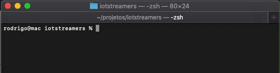

IoT Streamers Bot
=================

## Disponível em `discord` e `twitch.tv` ##
Integração em múltiplas plataformas ao mesmo tempo, traz a possibilidade de unificar tudo em apenas um só chat bot.
|  | <br/> |
| - | - |

## Crie Comandos ##
Possui grande facilidade em [criar novos comandos](#passo-5) de maneira que possa ser utilizado tanto no **discord** quanto na **twitch.tv** lidando com o mesmo código em javascript.
```JAVASCRIPT
command.on("source", (params, message) => {
    message.send("Confira o meu código fonte: https://github.com/iotstreamers/bot-js");
});
```

## Configuração ##

### Passo 1 ###
#### Baixando o projeto ####
Baixe ou clone o repositório do [projeto no github](https://github.com/iotstreamers/bot-js/archive/master.zip).

```SHELL
$ git clone https://github.com/iotstreamers/bot-js
```


### Passo 2 ###
#### Instalando dependências ####
Instale todas as dependências do bot utilizando um gerenciador de pacotes javascript. _(Ex: npm, yarn...)_
```SHELL
$ npm install
```


### Passo 3 ###
#### Preparando ambiente ####
Entre na pasta do bot e execute pela primeira vez o script,
ou você pode apenas adiantar copiando o arquivo '.env-example' para um novo arquivo '.env' antes de seguir para o próximo passso.

```SHELL
$ cd bot-js
$ node bot.js
```

### Passo 4 ###
#### Configurando ambiente ####
Configure o arquivo '.env' de acordo com seu ambiente.
```ENV
# DISCORD ENVIRONMENT CONFIG #
DISCORD_COMMAND_PREFIX = !
DISCORD_SECRET_TOKEN = NzY....
DISCORD_ROLE_VIP = 763...
DISCORD_ROLE_SUB = 763...
DISCORD_ROLE_STAFF = 763...
DISCORD_ROLE_BROADCAST = 763...

# DISCORD TWITCH CONFIG #
TWITCH_COMMAND_PREFIX = !
TWITCH_BOT_USERNAME = iot...
TWITCH_OAUTH_TOKEN = oauth:oa9...
TWITCH_CHANNELS = jul...,dor...,kad...
TWITCH_TAG_VIP = vip
TWITCH_TAG_SUB = subscriber
TWITCH_TAG_STAFF = moderator
TWITCH_TAG_BROADCAST = broadcaster
```

### Passo 5 ###
#### Criação de Comandos _(opcional)_ ####
Se oriente por outros exemplos da pasta 'commands/', uma opção é apenas criar novos comandos em um arquivo já existente, ou adiciona-los em novos arquivos, mas repetindo certos trechos de código essenciais para interpretação do programa.

* **nota** existem arquivos que possui permissões especiais para todos os comandos, você pode usar isso para criar comandos secretos!

```Javascript
command.on("ping", (params, message) => {
    message.send("!pong");
});
```

### Passo 6 ###
#### Iniciando bot ####
Agora seu bot está pronto e pode ser executado!
```SHELL
$ node bot index.js
```

```